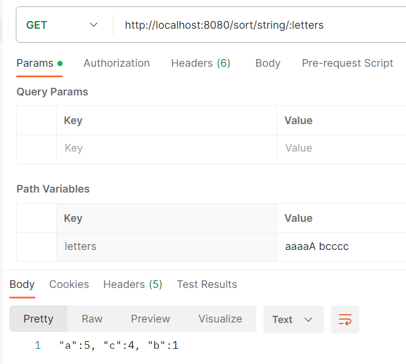

# Тестовое задание для Т1 Консалтинг.
---------------------------------------

Спроектировать(продумать формат и ограничения входящих/исходящих параметров) и реализовать REST API, вычисляющее частоту встречи символов по заданной строке. Результат должен быть отсортирован по убыванию количества вхождений символа в заданную строку.

В данном репозитории представлен бэкенд приложения.

## В проекте используется стек технологий:

Java 11
Spring Boot и сборка через Maven
REST API
MockMvc для тестов
Lombok
JUnit

## Ссылка для клонирования репозитория:
git clone https://github.com/julia-gerasimenko/test

## Приложение работает корректно в текущем виде при наличии:

установленного JDK версии 11,
сборка с использованием Maven.

Приложение работает на порту 8080. Доступ к API по адресу http://localhost:8080.

## API
``` GET /sort/string/{letters} ```  
Формат входящих и исходящих параметров: text.  
GET запрос - принимает в query параметрах строку, возвращает частоту встречи символов по заданной строке в порядке убывания.

### *Пример обработки запроса:*
